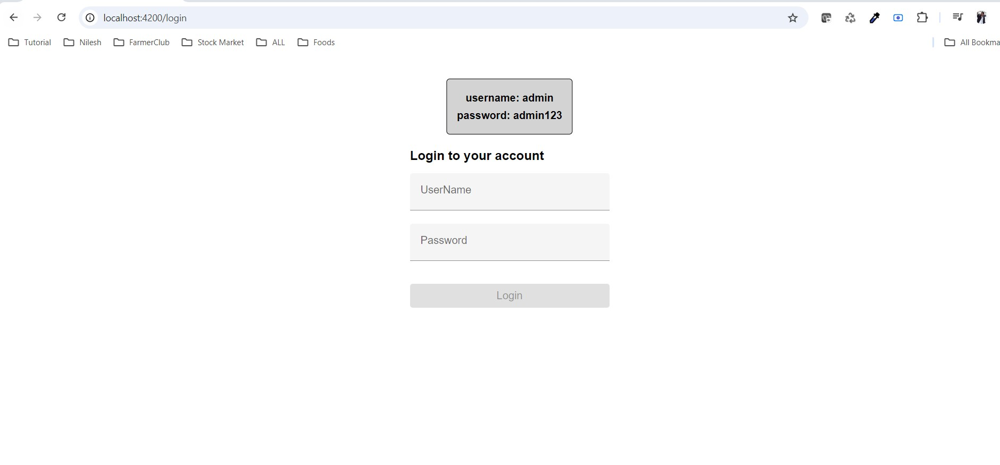
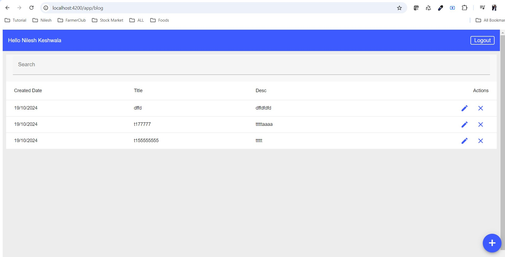

# BlogManagementApplication Angular 18 example project: CRUD with Rest API .Net 8.0

# Development server
open the project in VS 2022 and set startup project as BMA.API and run the project and port should be the https://localhost:7229

Open BMA.Client project in VS code then Run npm instal and then run ng serve for a dev server port should be the 4200 . Navigate to http://localhost:4200/. The application will automatically reload if you change any of the source files.

