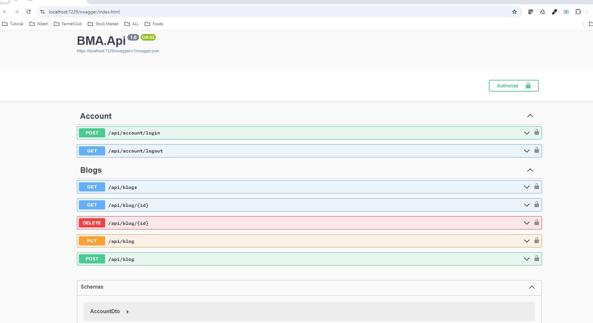

# BlogManagementApplication - CRUD with Rest API .Net 8.0

# Development server
Open the project in VS 2022 and set startup project as BMA.API and run the project and port should be the https://localhost:7229

